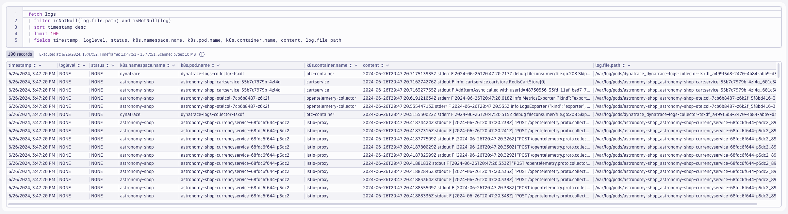

## Deploy OpenTelemetry Collector

### Dynatrace Distro - Daemonset (Node Agent)
https://docs.dynatrace.com/docs/extend-dynatrace/opentelemetry/collector/deployment#tabgroup--dynatrace-docs--agent

Pod (and container) logs are written to the filesystem of the Node where the pod is running.  Therefore the Collector must be deployed as a Daemonset to read the log files on the local Node.

```yaml
---
apiVersion: opentelemetry.io/v1alpha1
kind: OpenTelemetryCollector
metadata:
  name: dynatrace-logs
  namespace: dynatrace
spec:
  envFrom:
  - secretRef:
      name: dynatrace-otelcol-dt-api-credentials
  mode: "daemonset"
  image: "ghcr.io/dynatrace/dynatrace-otel-collector/dynatrace-otel-collector:latest"
```
Command:
```sh
kubectl apply -f opentelemetry/collector/logs/otel-collector-logs-crd-01.yaml
```
Sample output:
> opentelemetrycollector.opentelemetry.io/dynatrace-logs created

### Validate running pod(s)
Command:
```sh
kubectl get pods -n dynatrace
```
Sample output:
| NAME                             | READY | STATUS  | RESTARTS | AGE |
|----------------------------------|-------|---------|----------|-----|
| dynatrace-logs-collector-8q8tz   | 1/1   | Running | 0        | 1m  |

### `filelog` receiver
https://opentelemetry.io/docs/kubernetes/collector/components/#filelog-receiver
```yaml
config: |
    receivers:
      filelog:
        ...
    service:
      pipelines:
        logs:
          receivers: [filelog]
          processors: [batch]
          exporters: [otlphttp/dynatrace]
```

### Query logs in Dynatrace
DQL:
```sql
fetch logs
| filter isNotNull(log.file.path) and isNotNull(log)
| sort timestamp desc
| limit 100
| fields timestamp, loglevel, status, k8s.namespace.name, k8s.pod.name, k8s.container.name, content, log.file.path
```
Result:

