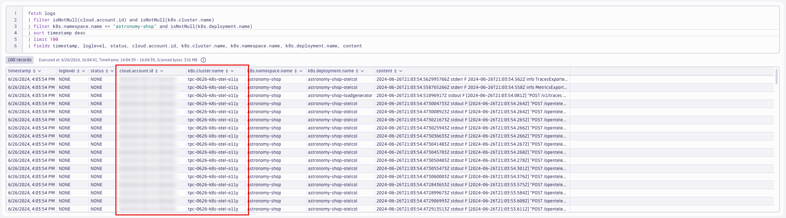

## resourcedetection Processor

### Add `resourcedetection` processor
https://github.com/open-telemetry/opentelemetry-collector-contrib/blob/main/processor/resourcedetectionprocessor/README.md#gcp-metadata
```yaml
processors:
  resourcedetection/gcp:
    detectors: [env, gcp]
    timeout: 2s
    override: false
```

**note:** for this lab, the Kind cluster does not have cloud metadata to collect.  These values will be spoofed for the purposes of this lab.
```yaml
resource/kind:
  attributes:
  - key: cloud.account.id
    value: dt-k8s-o11y-account
    action: insert
  - key: k8s.cluster.name
    value: dt-k8s-o11y-kind
    action: insert
```

Command:
```sh
kubectl apply -f opentelemetry/collector/logs/otel-collector-logs-crd-03.yaml
```
Sample output:
> opentelemetrycollector.opentelemetry.io/dynatrace-logs configured

### Validate running pod(s)
Command:
```sh
kubectl get pods -n dynatrace
```
Sample output:
| NAME                             | READY | STATUS  | RESTARTS | AGE |
|----------------------------------|-------|---------|----------|-----|
| dynatrace-logs-collector-fbtk5   | 1/1   | Running | 0        | 1m  |

### Query logs in Dynatrace
DQL:
```sql
fetch logs
| filter isNotNull(cloud.account.id) and isNotNull(k8s.cluster.name)
| filter k8s.namespace.name == "astronomy-shop" and isNotNull(k8s.deployment.name)
| sort timestamp desc
| limit 100
| fields timestamp, loglevel, status, cloud.account.id, k8s.cluster.name, k8s.namespace.name, k8s.deployment.name, content
```
Result:

