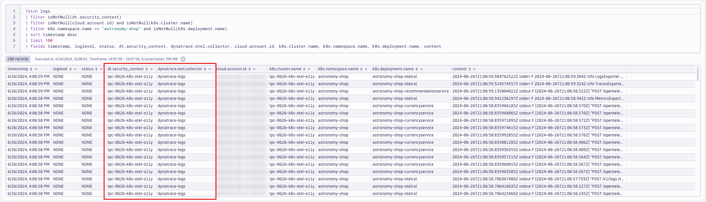

## resource Processor

### Add `resource` processor (attributes)
https://github.com/open-telemetry/opentelemetry-collector-contrib/tree/main/processor/resourceprocessor

The `resource` processor allows us to directly add, remove, or change resource attributes on the telemetry.
```yaml
processors:
    resource:
        attributes:
        - key: k8s.pod.ip
          action: delete
        - key: telemetry.sdk.name
          value: opentelemetry
          action: insert
        - key: dynatrace.otel.collector
          value: dynatrace-logs
          action: insert
        - key: dt.security_context
          from_attribute: k8s.cluster.name
          action: insert
```
Command:
```sh
kubectl apply -f opentelemetry/collector/logs/otel-collector-logs-crd-04.yaml
```
Sample output:
> opentelemetrycollector.opentelemetry.io/dynatrace-logs configured

### Validate running pod(s)
Command:
```sh
kubectl get pods -n dynatrace
```
Sample output:
| NAME                             | READY | STATUS  | RESTARTS | AGE |
|----------------------------------|-------|---------|----------|-----|
| dynatrace-logs-collector-xx6km   | 1/1   | Running | 0        | 1m  |

### Query logs in Dynatrace
DQL:
```sql
fetch logs
| filter isNotNull(dt.security_context)
| filter isNotNull(cloud.account.id) and isNotNull(k8s.cluster.name)
| filter k8s.namespace.name == "astronomy-shop" and isNotNull(k8s.deployment.name)
| sort timestamp desc
| limit 100
| fields timestamp, loglevel, status, dt.security_context, dynatrace.otel.collector, cloud.account.id, k8s.cluster.name, k8s.namespace.name, k8s.deployment.name, content
```
Result:

