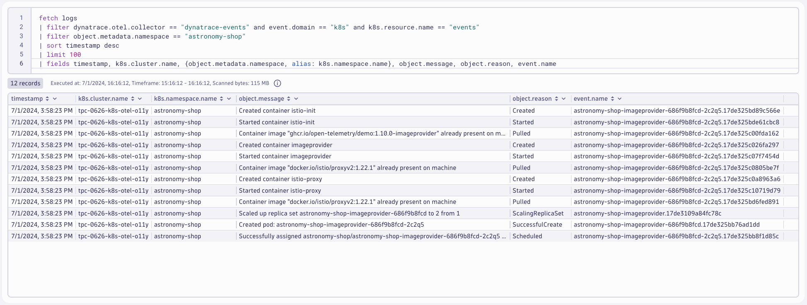

## Generate Events

### Generate events using deployment scale command
https://kubernetes.io/docs/reference/kubectl/generated/kubectl_scale/

Command:
```sh
kubectl scale deployment astronomy-shop-imageprovider -n astronomy-shop --replicas=2
```
Sample output:
> deployment.apps/astronomy-shop-imageprovider scaled

Command:
```sh
kubectl scale deployment astronomy-shop-imageprovider -n astronomy-shop --replicas=1
```
Sample output:
> deployment.apps/astronomy-shop-imageprovider scaled

### Query logs in Dynatrace
DQL:
```sql
fetch logs
| filter dynatrace.otel.collector == "dynatrace-events" and event.domain == "k8s" and k8s.resource.name == "events"
| filter object.metadata.namespace == "astronomy-shop"
| sort timestamp desc
| limit 100
| fields timestamp, k8s.cluster.name, {object.metadata.namespace, alias: k8s.namespace.name}, object.message, object.reason, event.name
```
Result:

